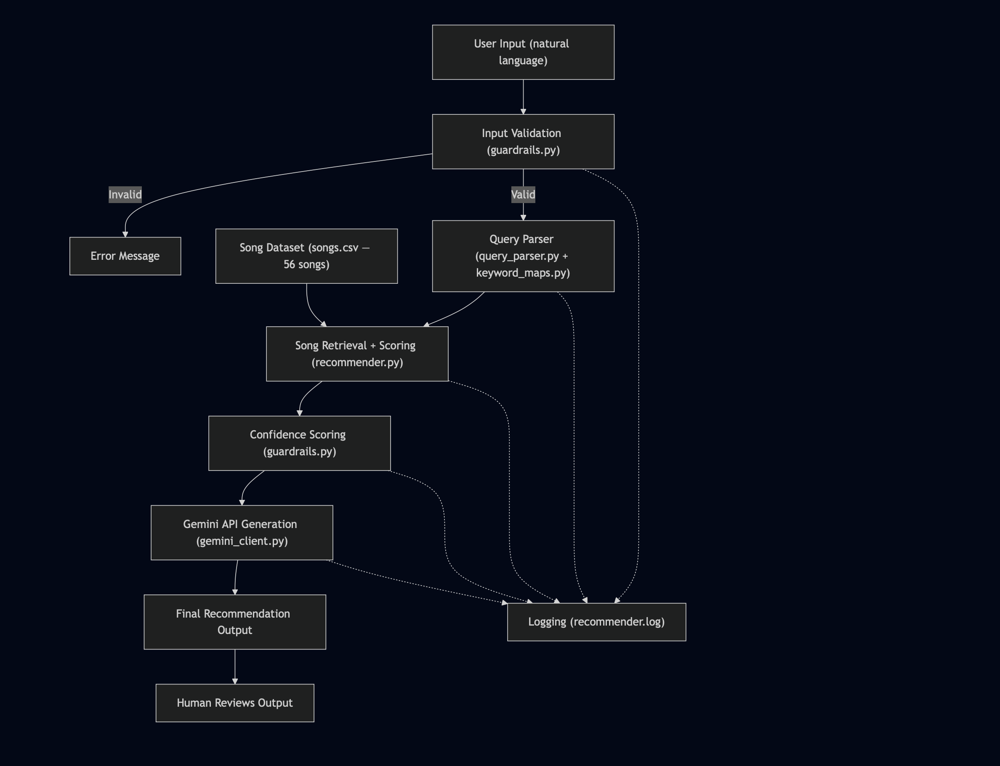
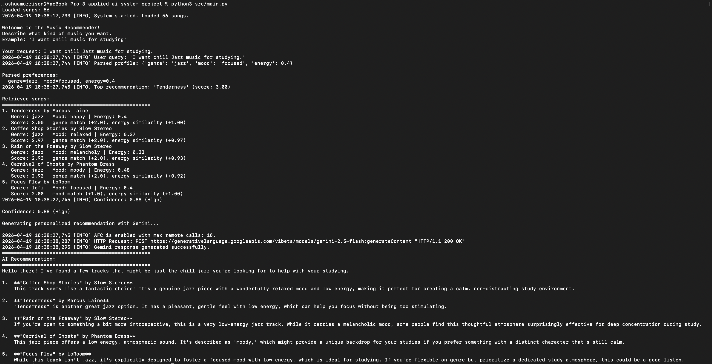
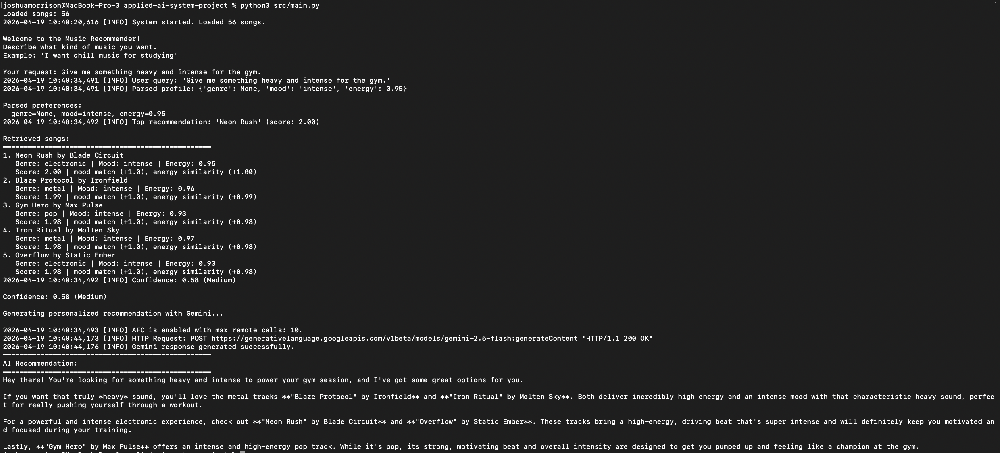
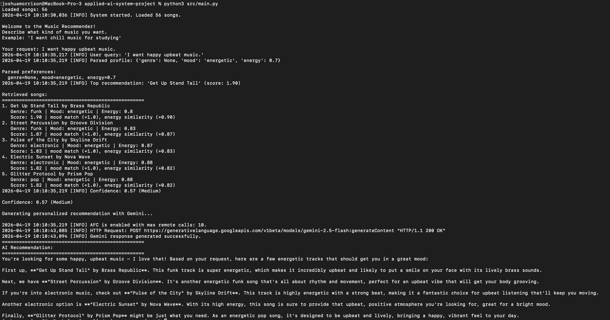

# AI Music Recommender

An AI-powered music recommendation system that uses **Retrieval-Augmented Generation (RAG)** to provide personalized, conversational song recommendations. Users describe what kind of music they want in plain English, and the system retrieves relevant songs from a curated dataset and uses Google Gemini to generate a friendly, natural-language recommendation.

## Original Project

This project extends the **Music Recommender Simulation** from Module 3 of CodePath's AI110 course. The original project was a content-based recommender that scored songs against a hardcoded user taste profile using three weighted features — genre match (+2.0), mood match (+1.0), and energy similarity (up to +1.0). It had no AI integration, no natural language input, and no conversational output. The original repo can be found [here](https://github.com/joshmorrison04/ai110-module3show-musicrecommendersimulation-starter).

## Architecture Overview

The system follows a RAG (Retrieval-Augmented Generation) pipeline:

1. **User Input** — The user types a natural language description of what they want to listen to
2. **Input Validation** — Guardrails check for empty, too-short, or too-long inputs before processing
3. **Query Parsing** — A keyword-based parser extracts structured preferences (genre, mood, energy) from the natural language input
4. **Retrieval + Scoring** — The recommender scores all 56 songs against the parsed preferences and returns the top 5
5. **Confidence Scoring** — The system rates how confident it is in the results based on how many preferences were parsed and how strong the matches are
6. **AI Generation** — The retrieved songs and the user's original query are sent to Google Gemini, which generates a conversational recommendation
7. **Logging** — Every step is recorded to `logs/recommender.log` for debugging and reliability tracking



## Setup Instructions

### Prerequisites
- Python 3.8 or higher
- A Google Gemini API key (free tier) from [aistudio.google.com/apikey](https://aistudio.google.com/apikey)

### Installation

1. Clone the repository:
   ```bash
   git clone https://github.com/joshmorrison04/applied-ai-system-project.git
   cd applied-ai-system-project
   ```

2. Install dependencies:
   ```bash
   pip install -r requirements.txt
   ```

3. Create a `.env` file in the project root with your Gemini API key:
   ```
   GEMINI_API_KEY=your-api-key-here
   ```

4. Run the application:
   ```bash
   cd src
   python main.py
   ```

## Sample Interactions

### Example 1: Chill study music


### Example 2: High-energy gym music


### Example 3: Happy upbeat music


## Design Decisions

**RAG over direct LLM querying:** I chose to build a RAG pipeline rather than sending everything directly to Gemini. This keeps recommendations grounded in real data from my song catalog — the AI can only recommend songs that actually exist in the dataset. It also gives me explainability (I can show exactly why each song was retrieved via the scoring breakdown) and resilience (if the API goes down, the retrieval step still works).

**Keyword-based parser over LLM parsing:** The query parser uses dictionary-based keyword matching rather than sending the query to Gemini for parsing. This is faster, free (no API call needed), and predictable. The tradeoff is that it can miss uncommon phrasings — for example, it catches "happy" but might miss "happiness." I addressed this limitation with confidence scoring that warns users when the parser couldn't extract strong preferences.

**None-based preference handling:** When the parser can't identify a genre, mood, or energy level, it returns `None` instead of a default value. The scoring logic then skips that attribute entirely. This prevents the system from biasing results — an earlier version defaulted to "pop" when no genre was found, which meant every vague query returned pop songs regardless of intent.

**Gemini 2.5 Flash model:** I used the `gemini-2.5-flash` model because it's available on the free tier and fast enough for real-time recommendations. The prompt is carefully engineered to constrain the AI to only recommend songs from the retrieved list, keeping responses grounded.

## Testing Summary

The system was tested with a variety of inputs including specific queries (e.g., "I want chill jazz for studying"), vague queries (e.g., "music"), edge cases (empty input, very short input), and queries with no matching keywords. The confidence scoring system correctly identified strong matches as High confidence and weak or vague matches as Low confidence. Input validation successfully caught invalid inputs before they reached the API. All interactions were logged to `logs/recommender.log` for review. The main limitation discovered during testing was the keyword-based parser — uncommon phrasings or synonyms not in the dictionary would result in `None` values and lower-quality recommendations.

## Reflection

Building this project taught me how RAG systems work in practice — the separation between retrieval and generation is a deliberate design choice, not just an implementation detail. Having my own scoring logic retrieve songs before the LLM generates a response gives me control, explainability, and reliability that I wouldn't have if I just asked Gemini to pick songs on its own.

I also learned that prompt engineering matters a lot. Small changes to the instructions I sent to Gemini — like telling it to "only use songs from the list above" and "be honest if matches seem weak" — made a big difference in the quality and trustworthiness of the output.

The biggest surprise was how much the parser limitations affected the overall system. A sophisticated AI generation step can't fix bad retrieval — if the wrong songs are retrieved, even the best LLM will give poor recommendations. This reinforced the idea that in RAG systems, retrieval quality is everything.

## Demo Walkthrough

See the sample interactions above for end-to-end screenshots of the system running with different inputs.

## File Structure

```
applied-ai-system-project/
├── assets/
│   └── Diagram.png              # System architecture diagram
├── data/
│   └── songs.csv                # Song dataset (56 songs)
├── logs/
│   └── recommender.log          # Runtime logs
├── src/
│   ├── main.py                  # Entry point — runs the full pipeline
│   ├── recommender.py           # Scoring logic and song loading
│   ├── query_parser.py          # Natural language → structured preferences
│   ├── keyword_maps.py          # Keyword dictionaries for the parser
│   └── gemini_client.py         # Gemini API integration and prompt engineering
├── tests/
│   └── test_recommender.py      # Unit tests for scoring logic
├── .env                         # API key (not committed to Git)
├── .gitignore
├── model_card.md
├── README.md
└── requirements.txt
```
